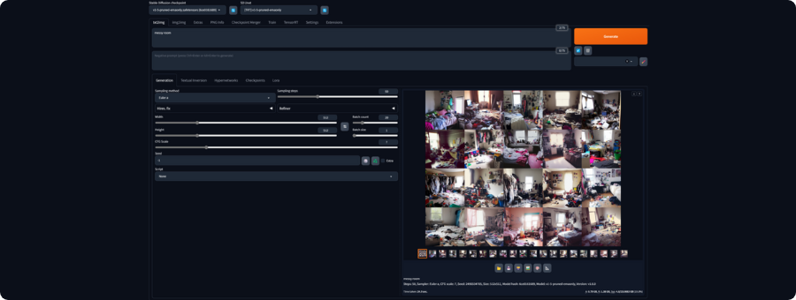

[](https://elmadichoaib.vercel.app)  

# Getting Started with Jetson Orin Nano

This repository is a guide to help you get started with the `Jetson Orin Nano Developer Kit`. It walks through the essential setup steps, recommended tools, and best practices to prepare your board for AI and embedded systems projects.

The **Jetson Orin Nano** is a compact AI development board from **NVIDIA**, designed for edge computing and robotics. It offers powerful GPU and CPU performance, supports deep learning frameworks, and is ideal for running computer vision, machine learning, and embedded AI applications.

<div align="center">


</div>

## Repository Structure

- **Docs**: Step-by-step setup and usage documentation for the Jetson Orin Nano.
- **Examples**: Scripts demonstrating how to use the Jetson Orin Nano with other tools.
- **Images**: Visuals and screenshots related to setup or board usage.

## Initial Setup Overview

You can set up the Jetson Orin Nano from scratch using the steps in the first guide. The summary below shows what you'll need and how to get started.

- **What you Need Before you Start**: Tools and hardware required for setup.
- **Installing the Operating System**: Steps to flash the Jetson OS image onto a microSD card.
- **Adding NVMe SSD Storage**: How to mount an SSD to extend the board's storage.
- **Powering Up and First Boot**: Connecting peripherals and booting into the OS for the first time.

<div align="center">


</div>

## Running a Local LLM

You can run a language model locally on the Jetson Orin Nano using Ollama and Open WebUI. The steps below show how to install and get them running.

### Installing Ollama

```bash
git clone https://github.com/dusty-nv/jetson-containers
```

```bash
bash jetson-containers/install.sh
```

```bash
jetson-containers run --name ollama $(autotag ollama)
```

### Running an LLM on the Command Line

```bash
ollama run llama3.2:3b
```

To end the session, type:

```bash
/bye
```

### Running an LLM on Open WebUI

```bash
sudo docker run -d --network=host \
    -v ${HOME}/open-webui:/app/backend/data \
    -e OLLAMA_BASE_URL=http://127.0.0.1:11434 \
    --name open-webui \
    --restart always \
    ghcr.io/open-webui/open-webui:main
```

Then open a browser and go to: [http://JETSON_IP:8080](http://JETSON_IP:8080)

<div align="center">


</div>

## Running a Remote Local AI Server

The third guide in the `Docs` folder shows how to access your Jetson Orin Nano remotely from another computer on the same network. This allows you to treat the Jetson as a local AI server.

## Running Stable Diffusion

The fourth guide in the `Docs` folder explains how to run Stable Diffusion locally on the Jetson Orin Nano using `jetson-containers`.

Run one of the following commands:

```bash
jetson-containers run $(autotag stable-diffusion-webui)
```

or

```bash
jetson-containers run dustynv/stable-diffusion-webui:r35.3.1
```

Once it starts, check the terminal output for the local URL to access the Stable Diffusion WebUI.

<div align="center">



</div>

## Integrating a Remote MySQL Database

You can configure and connect a MySQL database to the Jetson Orin Nano for data management and application integration.

### MySQL Server Setup on Ubuntu 22.04

```bash
sudo apt update
```

```bash
sudo apt-get install mysql-server
```

```bash
systemctl is-active mysql
```

```bash
sudo mysql_secure_installation
```

Then log in:

```bash
sudo mysql
```

```bash
ALTER USER 'root'@'localhost' IDENTIFIED WITH mysql_native_password BY 'Password123#@!';
FLUSH PRIVILEGES;
QUIT
```

And reconnect:

```bash
mysql -u root -p
```

### Install MySQL Workbench

```bash
sudo snap install mysql-workbench-community
```

Then launch it from the Applications menu.

### Create and Use a Database

```bash
mysql -u root -p
CREATE DATABASE database_name;
SHOW DATABASES;
USE database_name;
```

### Connect the Jetson to a Remote MySQL Server

Edit MySQL config:

```bash
sudo nano /etc/mysql/mysql.conf.d/mysqld.cnf
```

Change `bind-address = 127.0.0.1` to `bind-address = 0.0.0.0`

Restart MySQL:

```bash
sudo systemctl restart mysql
```

Allow remote access:

```bash
sudo mysql
GRANT ALL PRIVILEGES ON *.* TO 'root'@'%' IDENTIFIED BY 'Password123#@!';
FLUSH PRIVILEGES;
```

Install Python connector:

```bash
pip install mysql-connector-python
```

Use Python to connect using IP, credentials, and query the database. You can find example scripts for this inside the `Examples` folder.

## Repository Goals

To make it easy for beginners and first-time users to:

- Set up and boot the Jetson Orin Nano successfully
- Understand the board’s basic interfaces and boot process
- Prepare the device for AI/robotics applications

## Related Work

This repository is part of my **PFA (Projet de Fin d'Année)**. The project is about smart cities and the use of smart sensors to count vehicles and measure things like traffic flow, speed, pollution, and more. The Jetson Orin Nano is used as the main controller. It will be linked to the main project repository once completed.
