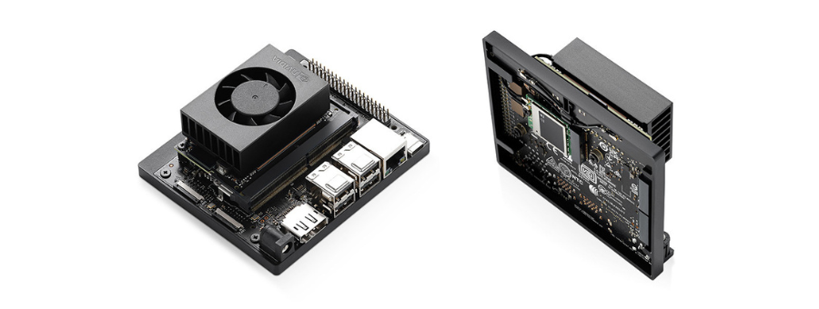
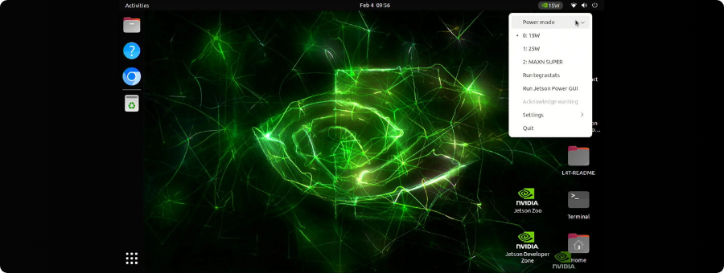
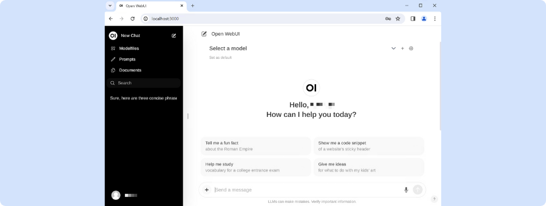

[](https://elmadichoaib.vercel.app)  

# Getting Started with Jetson Orin Nano

This repository is a guide to help you get started with the `Jetson Orin Nano Developer Kit`. It walks through the essential setup steps, recommended tools, and best practices to prepare your board for AI and embedded systems projects.

The **Jetson Orin Nano** is a compact AI development board from **NVIDIA**, designed for edge computing and robotics. It offers powerful GPU and CPU performance, supports deep learning frameworks, and is ideal for running computer vision, machine learning, and embedded AI applications.

<div align="center">



</div>

## Repository Structure

- **Docs**: Step-by-step setup and usage documentation for the Jetson Orin Nano.
- **Images**: Visuals and screenshots related to setup or board usage.

## Initial Setup Overview

You can set up the Jetson Orin Nano from scratch using the steps in the first guide. The summary below shows what you'll need and how to get started.

- **What you Need Before you Start**: Tools and hardware required for setup.
- **Installing the Operating System**: Steps to flash the Jetson OS image onto a microSD card.
- **Adding NVMe SSD Storage**: How to mount an SSD to extend the board's storage.
- **Powering Up and First Boot**: Connecting peripherals and booting into the OS for the first time.

<div align="center">



</div>

## Running a Local LLM

You can run a language model locally on the Jetson Orin Nano using Ollama and Open WebUI. The steps below show how to install and get them running.

### Installing Ollama

```bash
git clone https://github.com/dusty-nv/jetson-containers
```

```bash
bash jetson-containers/install.sh
```

```bash
jetson-containers run --name ollama $(autotag ollama)
```

### Running an LLM on the Command Line

```bash
ollama run llama3.2:3b
```

To end the session, type:

```bash
/bye
```

### Running an LLM on Open WebUI

```bash
sudo docker run -d --network=host \
    -v ${HOME}/open-webui:/app/backend/data \
    -e OLLAMA_BASE_URL=http://127.0.0.1:11434 \
    --name open-webui \
    --restart always \
    ghcr.io/open-webui/open-webui:main
```

Then open a browser and go to: [http://JETSON_IP:8080](http://JETSON_IP:8080)

<div align="center">



</div>

## Repository Goals

To make it easy for beginners and first-time users to:

- Set up and boot the Jetson Orin Nano successfully
- Understand the board’s basic interfaces and boot process
- Prepare the device for AI/robotics applications

## Related Work

This repository is part of my **PFA (Projet de Fin d'Année)**, which involves building an AI-powered robotic system using this board as the core controller. It will be linked to the main project repository once completed.
